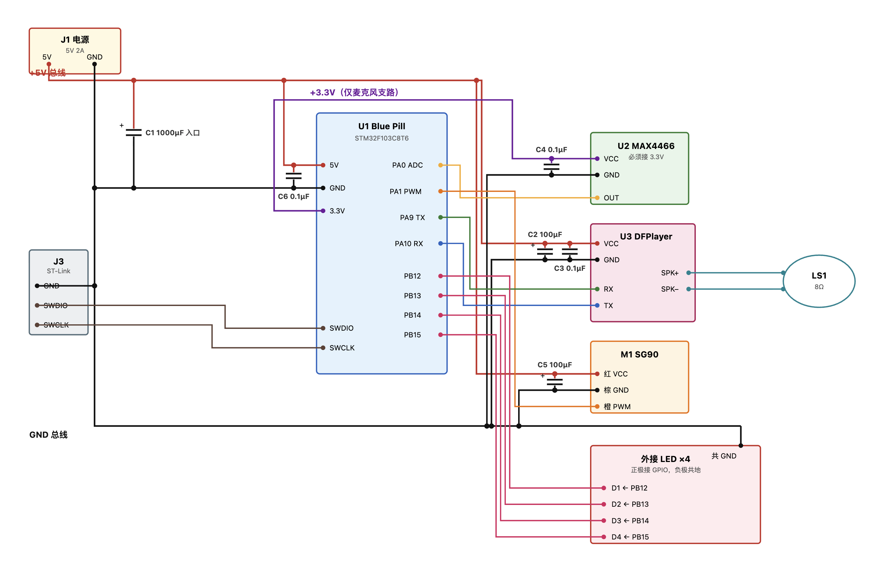

# NoiseRada

噪声雷达

## 演示视频

[B站](https://www.bilibili.com/video/BV1KBMB6gELp/?vd_source=d6a1f69c9c2936e218539f8d56c4da94)

## 3D模型

[拓竹社区](https://makerworld.com.cn/zh/models/2827692-zao-sheng-lei-da?from=search#profileId-3299917)

## 电路连接

## 物料清单

STM32F103C8T6 最小系统板 x1
MAX4466麦克风 x1
Zave MP3播放器模块 x1
TF卡 x1
扬声器8欧2W 直径40mm x1
舵机SG90 9克 x1
3mm 3-12V 发光LED x4

电路洞洞板 5*7cm x1
接线端子 KF301-2P x10
瓷片电容104 0.1uF 50V x10
电解电容16V 100uF x10
电解电容16V 1000uF x10

热缩管若干
杜邦线若干

轴承 内直径15mm, 外直径24mm x1
5V2A电源适配器
